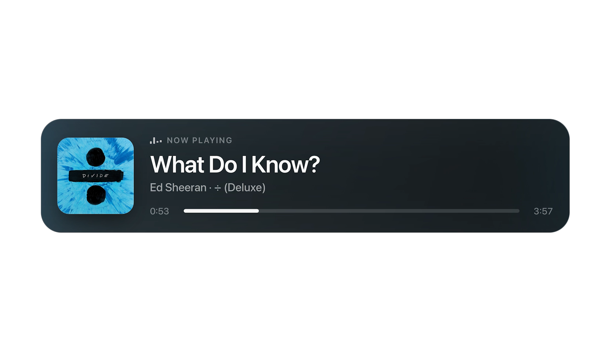

<div align="center">

# OBS Apple Music Progress Bar

A lightweight, transparent OBS overlay that shows the track currently playing in
**macOS Music / Apple Music** — complete with album artwork and a live progress bar.


**English** · [日本語](README.ja.md)



</div>

---

## Overview

A small Python script polls macOS Music.app for the current track — title, artist,
album, playback position, duration, and artwork — and writes it to
`runtime/nowplaying.json`. The bundled `overlay.html` reads that file and renders a
clean, transparent overlay you can drop straight into an OBS **Browser Source**.

No third-party Python packages and no build step: the tool relies only on the
macOS built-in commands `osascript` and `sips`.

## Features

- Live "now playing" display for macOS Music / Apple Music
- Fully transparent overlay, ready for an OBS Browser Source
- Real-time progress bar with elapsed and total time
- Album artwork exported directly from Music.app, with an automatic iTunes Search API fallback
- Built-in scaling presets for 1080p and 4K layouts
- Demo mode for previewing the layout without playing anything

## Requirements

- macOS
- Music.app / Apple Music
- Python 3.9 or later
- OBS Studio

> No additional Python packages are required — the tool uses the macOS built-in
> `osascript` and `sips` commands.

## Quick Start

Clone the repository and start the local server:

```bash
git clone https://github.com/m-shintaro/apple-music-obs-overlay.git
cd apple-music-obs-overlay
python3 nowplaying.py
```

Then, in OBS, add a **Browser Source** and point it at:

```text
http://localhost:8765/overlay.html
```

Recommended source size:

| Resolution | Minimum size |
| ---------- | ------------ |
| 1080p      | `896 × 300`  |
| 4K         | `1792 × 600` |

The area around the card is transparent, so a larger OBS source size is perfectly fine.

## Usage

### 4K and custom scaling

For 4K streams, append `?profile=4k` to the URL:

```text
http://localhost:8765/overlay.html?profile=4k
```

Or set any custom scale factor:

```text
http://localhost:8765/overlay.html?scale=1.75
```

### Preview without playback

Preview the layout without relying on Music.app:

```bash
python3 nowplaying.py --demo
```

Write the files to `runtime/` once and exit:

```bash
python3 nowplaying.py --once
```

### Command-line options

| Option                 | Default     | Description                                    |
| ---------------------- | ----------- | ---------------------------------------------- |
| `--port`               | `8765`      | HTTP server port                               |
| `--bind`               | `127.0.0.1` | HTTP server bind address                       |
| `--interval`           | `0.25`      | Music.app polling interval, in seconds         |
| `--country`            | `JP`        | iTunes Search API country code                 |
| `--no-network-artwork` | off         | Disable the iTunes Search API artwork fallback |
| `--demo`               | off         | Run with sample data for preview               |
| `--once`               | off         | Write files once and exit                      |
| `--diagnose-artwork`   | off         | Diagnose direct artwork export from Music.app  |

## macOS Permissions

On first run, macOS may ask whether Terminal or Python is allowed to control Music.app.

If you accidentally denied it, re-enable access under
**System Settings → Privacy & Security → Automation** and allow Terminal / Python
to control Music.

## Artwork

Artwork is resolved in the following order:

1. **Direct export** — pulled from the Music.app `current track` via JXA.
2. **iTunes Search API fallback** — a lookup by `artist + title`, used only when
   direct export fails.

`runtime/nowplaying.json` includes `artworkSource` and `artworkError` fields.
`artworkSource: "music"` means the direct export succeeded, while
`artworkSource: "itunes"` means the fallback was used.

Diagnose direct export:

```bash
python3 nowplaying.py --diagnose-artwork
```

Disable the network fallback entirely:

```bash
python3 nowplaying.py --no-network-artwork
```

## Generated Files

While running, the tool writes the following files into `runtime/`:

| File                 | Description                                        |
| -------------------- | -------------------------------------------------- |
| `nowplaying.json`    | Track data consumed by the Browser Source          |
| `nowplaying.txt`     | Plain-text output, usable as an OBS Text Source    |
| `cover_direct.*`     | Artwork exported directly from Music.app           |
| `cover_fallback.jpg` | Artwork fetched via the iTunes Search API fallback |

> Everything under `runtime/` is ignored by `.gitignore`.

## Troubleshooting

<details>
<summary><strong>Nothing appears in OBS</strong></summary>

- Make sure Music.app is running.
- The overlay does not update while playback is stopped.
- Confirm the Browser Source URL is `http://localhost:8765/overlay.html`.
- Run `python3 nowplaying.py --demo` to verify the overlay layout.

</details>

<details>
<summary><strong>Artwork does not appear</strong></summary>

- Run `python3 nowplaying.py --diagnose-artwork` to inspect the direct-export diagnostics.
- The iTunes Search API fallback requires network access.
- Use `--no-network-artwork` if you would rather not send track metadata over the network.

</details>

<details>
<summary><strong>The port is already in use</strong></summary>

Start the server on a different port:

```bash
python3 nowplaying.py --port 8766
```

Then update the OBS Browser Source URL to match:

```text
http://localhost:8766/overlay.html
```

</details>

## Privacy

This tool reads playback information from your local Music.app and writes it to the
local `runtime/` directory.

By default, when direct artwork export fails, the track title and artist are sent to
the iTunes Search API to look up fallback artwork. Pass `--no-network-artwork` to
disable this behavior.

## Contributing

Issues and pull requests are welcome. When reporting a bug, it helps to include your
macOS version, OBS version, and the output of `python3 nowplaying.py --diagnose-artwork`.

## License

This project is released under the MIT License. See [LICENSE](LICENSE) for details.

## Credits

- **Creator** — shin ([GitHub: @m-shintaro](https://github.com/m-shintaro), [X: @xyzmiku](https://x.com/xyzmiku))
- [OBS Studio](https://obsproject.com/) — streaming software and Browser Source runtime
- Apple Music / Music.app — source of playback information on macOS
- [iTunes Search API](https://developer.apple.com/library/archive/documentation/AudioVideo/Conceptual/iTuneSearchAPI/) — fallback artwork lookup

---

> **Disclaimer** — This is not an official project by Apple Inc. or the OBS Project.
> Apple, Apple Music, iTunes, and macOS are trademarks of Apple Inc. OBS and OBS Studio
> are names of the OBS Project. Track metadata and artwork belong to their respective
> rights holders.
